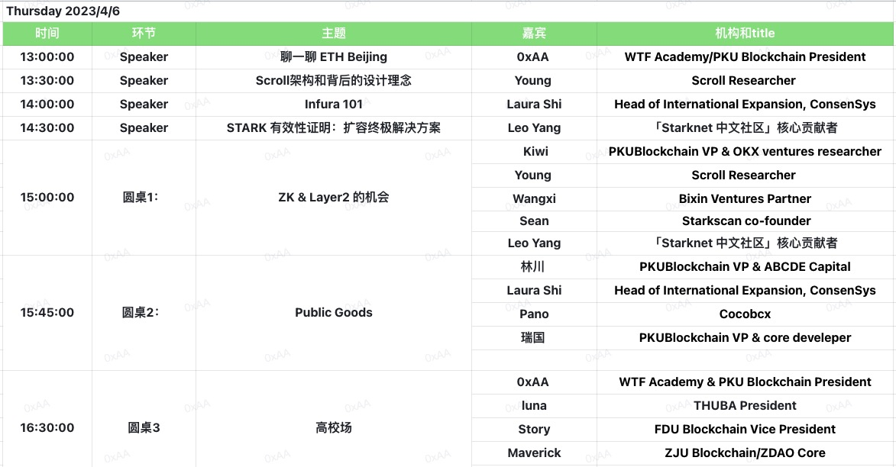

# ETH Beijing Hackathon

## 简述

2019年10月24日，在中央政治局第十八次集体学习时，习近平总书记强调，“把区块链作为核心技术自主创新的重要突破口”，“加快推动区块链技术和产业创新发展”。“区块链”已走进大众视野，成为社会的关注焦点。

ETH Beijing Hackathon是一次在北京举办的面向以太坊开发者的黑客马拉松活动，旨在促进以太坊生态系统在中国的发展。该活动受到以太坊基金会的支持。参与者可以利用活动期间的时间，开发基于以太坊区块链的应用程序或解决方案，并与其他开发者进行交流和合作。ETH Beijing Hackathon是全球以太坊社区中新兴的黑客马拉松，也是推动区块链技术和应用发展的重要平台之一。

## 时间
2023年4月5日 - 4月8日

## Place
北京，中国

## 奖池

$30,000+

## 官网

[https://ethbeijing.xyz](https://ethbeijing.xyz)

## 申请链接

[链接](https://docs.google.com/forms/d/e/1FAIpQLSe5qyxMneb3JULOdQhDCMvU7eEbnCGKTQ5G1uk1JKAwXC0IKw/viewform?usp=sf_link) (报名已经截止)

## 队伍信息

[队伍信息页面](https://github.com/WTFAcademy/ETHBeijing/blob/main/team-info.md)

## 黑客松赛道
### 主赛道: 

参赛团队必须从 3 条赛道中选择一条，每个主赛道奖金 $10000，其中第一名 $5000，第二名 $3000，第三名 $2000。

1. **公共品**: 在以太坊上构建开源项目。
2. **Layer2 创新应用**: 构建基于Layer 2的创新型应用项目。
3. **开放研究** (非开发者向): 链上数据/政策/安全/MEV/反女巫/... 方向的研究。

### 赞助商赛道

每个赞助商赛道奖金 $2500，其中第一名 $1500，第二名 $1000。

1. **Scroll**: 在 Scroll 上开发去中心化应用。

## Workshop
### 4月6日

## 日程表

| 日期 | 时间 | 活动 |
| --- | --- | --- |
| 4月5日 | 12点 | 签到开始 |
| | 18点 | 晚饭 |
| | 19点 | 项目介绍（每个团队2分钟） |
| | 24点 | 签到结束 |
| 4月6日 | 全天 | Buidl |
| | 9点 | 早饭 |
| | 12点 | 午饭 |
| | 13-18点 | workshop |
| | 18点 | 晚饭 |
| | 19点 | 项目汇报进展 |
| 4月7日 | 全天 | Buidl |
| | 9点 | 早饭 |
| | 12点 | 午饭 |
| | 13-18点 | workshop |
| | 18点 | 晚饭 |
| | 19点 | 项目汇报进展 |
| 4月8日 | 9点 | 早饭 |
| | 12点 | 午饭 |
| | 15点 | 提交项目 |
| | 15-18点 | 评委第一轮打分 |
| | 18点 | 晚饭 |
| | 19点 | Demo Day (每个赛道前5名，每个项目 5 分钟) |
| | 21点 | After Party |

## 主办方

- [PKU Blockchain](https://twitter.com/PKUBlockchain)
- [WTF Academy](https://twitter.com/WTFAcademy_)

## 协办方
- [Scroll](https://twitter.com/Scroll_ZKP)
- [ETHPlanet](https://twitter.com/ETHPlanet)

## 赞助商
- [Scroll](https://twitter.com/Scroll_ZKP)
- [Ethereum Foundation](https://twitter.com/EF_ESP)
- [Token Pocket](https://twitter.com/TokenPocket_TP)
- [Mask](https://twitter.com/realMaskNetwork)
- [LD Capital](https://twitter.com/LD_Capital)
- [Cocos BCX](https://twitter.com/CocosBCX)

## 合作伙伴和支持社区
- [Dorahacks](https://twitter.com/DoraHacks)
- MetaSpace
- [ThubaDAO](https://twitter.com/THUBA_DAO)
- More coming soon!

## 常问问题

### ETH Beijing（以太坊北京）是什么?

ETH Beijing 黑客松是一个让以太坊开发者齐聚北京并搭建项目的活动，2023年4月5日 - 4月8日（共 72 小时）。

### 谁被鼓励参加这个活动？

我们鼓励想在黑客松期间构建项目的开发人员、设计师和研究人员参与。

### ETH Beijing 收费吗？

ETH Beijing 免费入场。

### ETH Beijing 会提供为黑客提供旅行奖学金吗?

如果预算允许，我们将为学生提供食物、住宿和旅行补偿。

### 我可以远程参加这个活动吗？

不可以，Beijing Hackathon 是在北京举办的线下活动，你需要线下参与。

### 一个团队允许有多少成员？

每个团队总共最多可以有 5 名成员。

### 我可以在活动前开始搭建我的项目吗？

不可以。为了公平起见，参与者不应在黑客松开始前从事他们的项目，同时也不允许已有项目参加。但是您可以在黑客松前打磨想法，熟悉开发工具。

### 我可以在黑客松搭建什么项目？

我们在 ETH Beijing 提供 3 个主赛道和几个赞助赛道。每个项目必须选择 1 个主要赛道，并且可以选择任何合适的赞助商赛道。

### 是否有门票可以让观众参与？

因为北京的政策，我们限制参与活动的人数。本次活动只有入选黑客松的开发者可以参加，没有门票提供给观众。但是我们的 workshop 会线上直播，欢迎远程参与。
